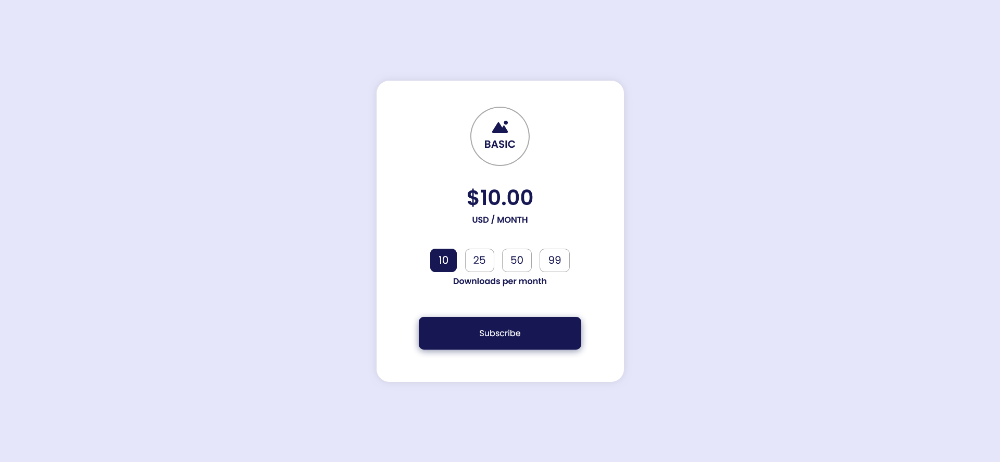

# Subscription Plan /ICodeThis challenge

This is a solution to a challenge "Subscription Plan" from the website [ICodeThis](https://icodethis.com/modes/design-to-code/182/submissions?page=1).

## Table of contents
- [Task](#task)
- [Screenshot](#screenshot)
- [Links](#links)
- [How it works](#how-it-works)
- [Built with](#built-with)
- [Author](#author)

## Task

Start with this design and transform it into a functional project using HTML, CSS, and JavaScript.
If you want to go the extra mile, expand upon it, and integrate your unique touch by adding animations and interactivity.
Prioritize creativity over pixel-perfect accuracy and showcase your developer ingenuity.

## Screenshot

## Links

[Subscription Plan Page](https://axinitm.github.io/Subscription-Plan-ICodeThis-challenge/)

## How it works

The user can select a subscription plan based on the number of downloads.
Subscription prices range from $10 for 10 downloads to $69 for 99 downloads.
After selecting a plan and clicking the "Subscribe" button, a modal window appears displaying the selected plan and a thank-you message.
The modal can be closed by clicking the "Close" button.
After closing the modal, the user is returned to the main subscription selection screen.

## Built with

- Semantic HTML5
- Modern CSS3
- Vanilla JavaScript
- Fully responsive design

## Author

- Website - [Andrei Martinenko](https://www.frontender.biz)
- Github - [@AxinitM](https://github.com/AxinitM)
- ICodeThis - [Axinit](https://icodethis.com/Axinit)
